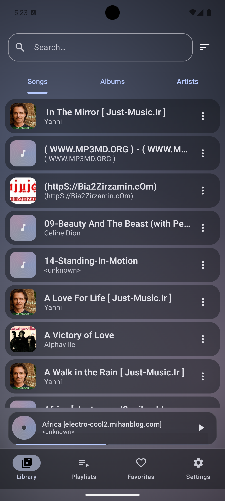
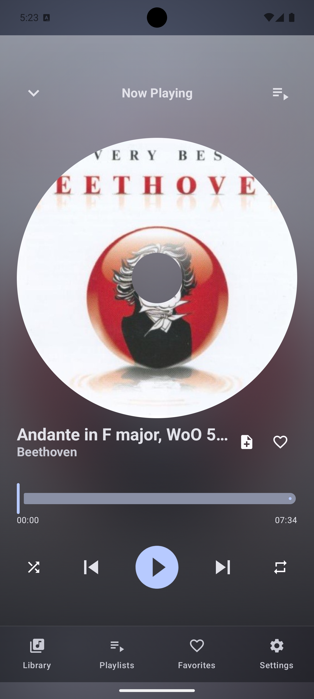
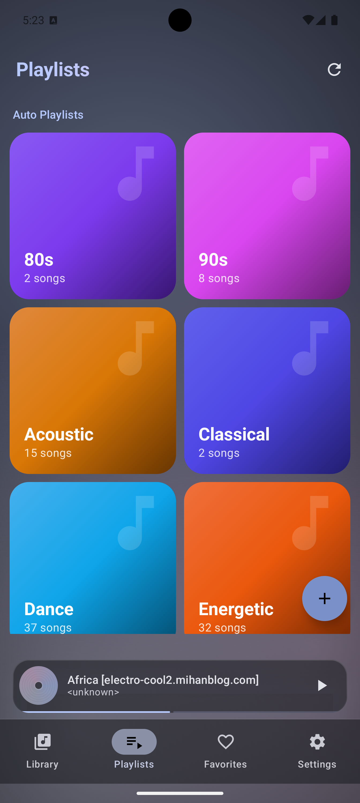
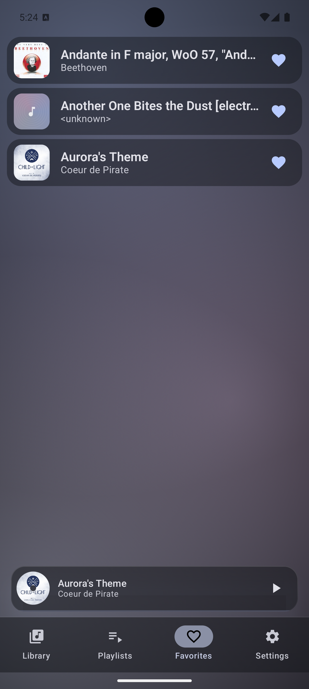
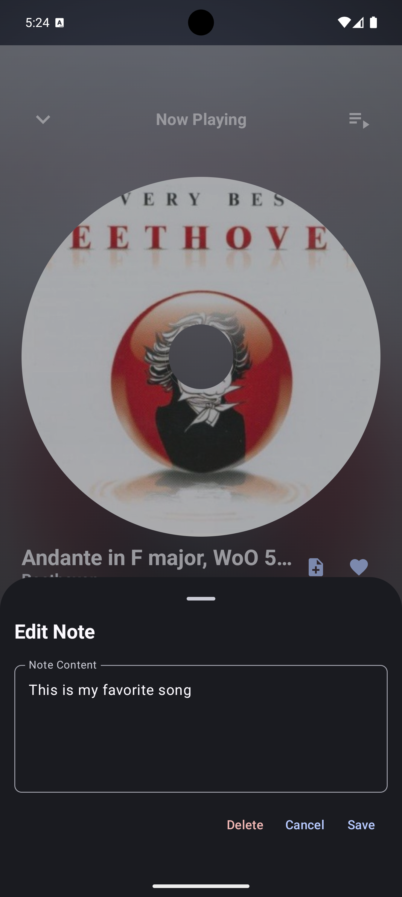
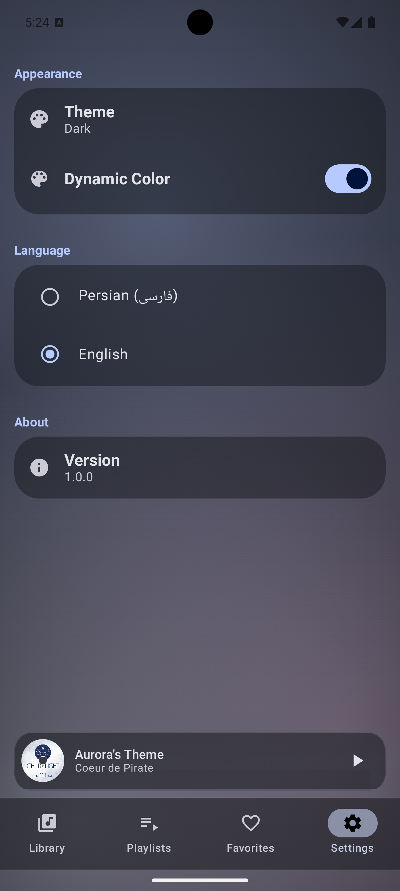
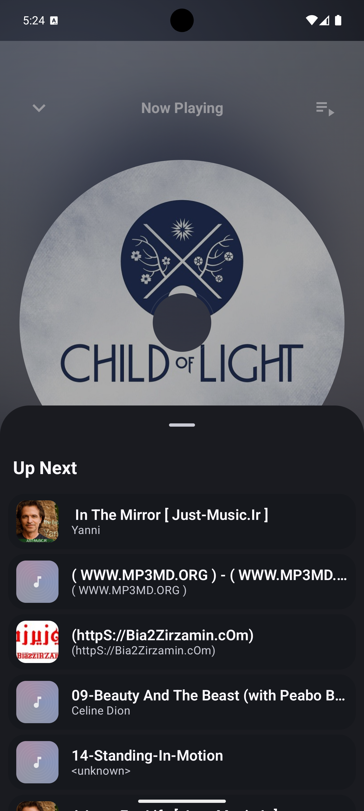

# Avang — آوانگ

A modern, fully offline Android music player built with Jetpack Compose, Media3, and a
Now-in-Android-style modular architecture.

- **Min SDK:** 29 · **Target/Compile SDK:** 37
- **Default language:** Persian (فارسی) — configurable at build time
- **Theme:** Liquid-glass (Material 3 + Haze blur)
- **Audio engine:** Media3 (ExoPlayer + MediaSession)
- **No INTERNET permission** — 100% offline

---

## Features

- Browse on-device songs, albums, and artists (MediaStore)
- Now Playing screen with album art, seek bar, and playback controls
- Mini player visible app-wide when music is playing
- Playlists — create, rename, delete, reorder, add/remove songs
- Favorites — toggle anywhere, dedicated screen
- Notes — add personal notes or lyrics to any song
- Shuffle, Repeat-all, Repeat-one
- Equalizer with presets and band control
- Dynamic per-app language switching (Persian / English)
- System / light / dark theme with dynamic color (Android 12+)
- Liquid-glass design with frosted blur surfaces

---

## Screenshots

<!-- Add your screenshots to the screenshots/ folder and they will appear here -->

| Library | Now Playing | Playlists |
|---|---|---|
|  |  |  |

| Favorites | Notes |
|---|---|
|  |  |

| Settings | Queue                           |
|---------------------------------------|---------------------------------|
|  |  |

---

## Architecture

The project follows the [Now in Android](https://github.com/android/nowinandroid) modular
architecture closely.

### Module map

```
:app
:build-logic
:core:common          :core:model         :core:designsystem
:core:database        :core:datastore     :core:data
:core:domain          :core:media         :core:ui
:core:testing
:feature:library      :feature:player     :feature:playlists
:feature:favorites    :feature:notes      :feature:equalizer
```

Each `:feature:*` is split into `:api` (navigation contracts, public routes) and
`:impl` (screens, ViewModels, internal logic). Features never depend on each other's
`:impl`.

### Key conventions

| Convention | Rule |
|---|---|
| **UDF** | State flows down, events flow up. ViewModels expose a single `StateFlow<UiState>` (sealed: `Loading / Success / Error`). |
| **Offline-first** | Room + MediaStore are the single source of truth. UI observes `Flow`. |
| **Composables** | Stateless, hoisted. `@Immutable` models. `derivedStateOf` to cut recompositions. |
| **DI** | Constructor injection via Hilt. `internal` visibility by default. |
| **Theme** | All colors, shapes, and typography come from `:core:designsystem`. |
| **ViewModel in Activity** | `by viewModels()` in `MainActivity`; feature screen ViewModels use `hiltViewModel()` as a default parameter. |
| **Flow collection in Activity** | `lifecycleScope.launch { lifecycle.repeatOnLifecycle(STARTED) { … } }` — not `collectAsStateWithLifecycle` — for state that must be ready before the first composition (theme, locale). |

### Data flow

```
MediaStore / Room / DataStore
        ↓
   Repository (SSOT)
        ↓
    Use Cases (optional)
        ↓
    ViewModel  →  UiState (StateFlow)
        ↓
    Composable (reads state, sends events up)
```

### Locale / Language

Language is persisted in DataStore as a BCP-47 tag (e.g. `"fa"`, `"en"`).
The compile-time default lives in a single place:

```toml
# gradle/libs.versions.toml
defaultLanguage = "fa"
```

At runtime, `AppCompatDelegate.setApplicationLocales()` applies the locale as a
per-app override. `MainActivity.attachBaseContext` re-applies it on every recreation
so there is no flicker after the first launch.

### Theme

Dark-theme preference is stored as `DarkThemeConfig` (`FOLLOW_SYSTEM / LIGHT / DARK`).
`MainActivity` collects the uiState in `lifecycleScope` before `setContent` so the
correct theme is applied on the first frame — matching the NiA splash-screen pattern.

---

## Getting started

### Requirements

| Tool | Version |
|---|---|
| Android Studio | Meerkat (2024.3) or newer |
| JDK | 17+ (enforced by `settings.gradle.kts`) |
| Gradle | 8.x (wrapper included) |
| Android device / emulator | API 29+ |

### Build

```bash
# Debug build
./gradlew assembleDebug

# Release build
./gradlew assembleRelease

# Run all unit tests
./gradlew test

# Run connected tests
./gradlew connectedAndroidTest
```

### Change the default language

Open `gradle/libs.versions.toml` and change the single line:

```toml
defaultLanguage = "fa"   # "en" for English, "fa" for Persian
```

This propagates to all modules via `BuildConfig.DEFAULT_LANGUAGE`.

---

## Contributing

### Branch strategy

```
main          ← stable, protected
dev           ← integration branch, PRs target this
feature/<name>  ← one branch per feature / fix
```

### Adding a new feature

1. Create `:feature:<name>:api` — route data class, `NavGraphBuilder` extension signature.
2. Create `:feature:<name>:impl` — screens, ViewModel, Hilt module.
3. Wire the navigation contract in `:app`'s `AppNavHost`.
4. Add the module to `settings.gradle.kts`.
5. Mark the relevant phase items done in `MASTER_PLAN.md`.

### Adding a new screen inside an existing feature

1. Add a route data class in `:feature:<name>:api`.
2. Implement the screen composable and ViewModel in `:feature:<name>:impl`.
3. Register with `NavGraphBuilder` in the feature's screen file.
4. Expose a `navigateTo<Screen>()` extension on `NavController` from `:api`.

### Code style

- Kotlin only. No Java.
- Follow the existing formatting (ktlint config in `build-logic`).
- No comments that explain *what* code does — only *why* (non-obvious constraints, workarounds).
- No hardcoded strings visible to users — all user-facing text goes in `core/ui/src/main/res/values/strings.xml` (Persian) and `values-en/strings.xml` (English).
- No hardcoded colors or dimensions outside `:core:designsystem`.

### Writing a ViewModel

```kotlin
@HiltViewModel
class MyViewModel @Inject constructor(
    private val myRepository: MyRepository,
) : ViewModel() {

    val uiState: StateFlow<MyUiState> = myRepository.data
        .map { MyUiState.Success(it) }
        .stateIn(viewModelScope, SharingStarted.WhileSubscribed(5_000), MyUiState.Loading)
}

sealed interface MyUiState {
    data object Loading : MyUiState
    data class Success(val data: MyData) : MyUiState
}
```

### Writing a screen composable

```kotlin
@Composable
internal fun MyScreen(
    onSomethingClick: () -> Unit,
    modifier: Modifier = Modifier,
    viewModel: MyViewModel = hiltViewModel(),   // default param — testable without Hilt
) {
    val uiState by viewModel.uiState.collectAsStateWithLifecycle()
    // ...
}
```

### Fakes over mocks

Unit tests use hand-written fakes from `:core:testing` (e.g. `FakeUserDataRepository`),
not Mockito mocks. Add a new fake there whenever you introduce a new repository interface.

---

## License

```
Copyright 2024 Alireza Javani

Licensed under the Apache License, Version 2.0 (the "License");
you may not use this file except in compliance with the License.
You may obtain a copy of the License at

    http://www.apache.org/licenses/LICENSE-2.0
```
